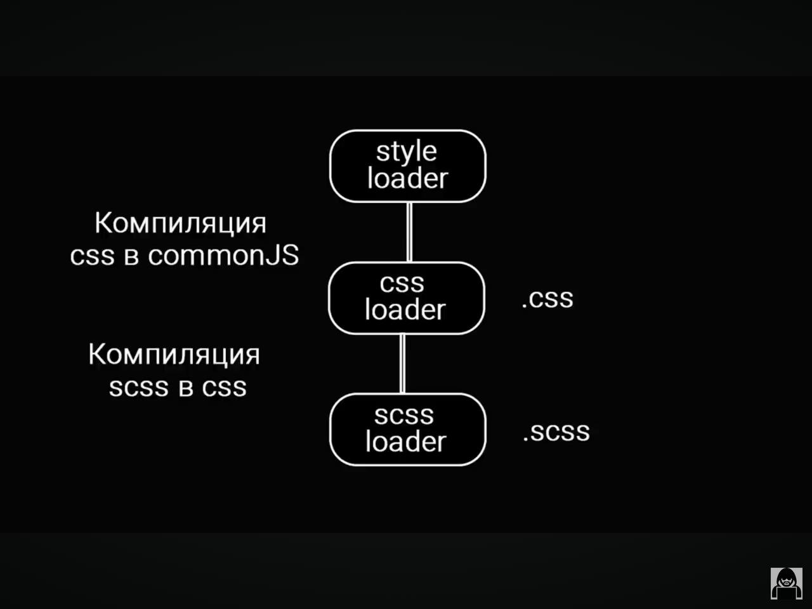

В вебпаке есть цепочка лоадеров перед  тем как собрать проект 

По тому расширению которое мы указываем в лоадере обработчик понимает какие файлы ему надо обработать и на выходе он их компилирует ( к примеру ts в js, Svg  в реакт компоненты и др). И ПОРЯДОК ЛОАДЕРОВ ОЧЕНЬ ВАЖЕН!
К ПРИМЕРК

Здксь мы коныертируем scss  в css а потом уже css  в commonJs  а потот уже css строки попадают в bundle

После создания реакт приложения если мы регим импортировать .css файл то прога обавлится так как нету исходного лоадера
поэтому для решения этой проблемы в webpack конфиге в rules надо добавить это 
 {
        test: /\.css$/i,
        use: ["style-loader", "css-loader"],
      },
      после этого мы можем уже работать со стилями